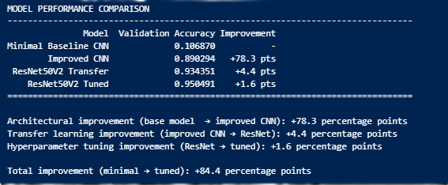

# Evaluating Pre-trained ResNet50V2 for Plant Disease Classification

## Project Overview

This project evaluates whether a pre-trained ResNet50V2 model can improve image classification accuracy compared to custom-built CNN architectures. Using the New Plant Diseases Dataset from Kaggle, I built three progressively complex models (a baseline CNN, an improved CNN, and a ResNet50V2 transfer learning model) and compared their performance on 10 tomato disease classes. The final tuned model achieved 95.0% accuracy, up from 10.7% with the baseline.

---

## Approach

The analysis is contained in a single notebook (`notebooks/resnet_plant_disease_classification.ipynb`) that builds three progressively complex models:

1. **Minimal baseline CNN** - Establish baseline performance
2. **Improved CNN** - Add layers, dropout regularization, and modern techniques
3. **ResNet50V2 transfer learning** - Freeze ImageNet weights and train a classification head
4. **Hyperparameter tuning** - Optimize the ResNet model using Keras Tuner with Bayesian search

---

## Results

- **Minimal Baseline CNN:** 10.7% accuracy
- **Improved CNN:** 89.0% accuracy
- **ResNet50V2 Transfer Learning:** 93.4% accuracy
- **ResNet50V2 Tuned:** 95.0% accuracy

**Total improvement:** 10.7% → 95.0% (+84.3 percentage points)

---

## Lessons Learned

- Image preprocessing proved more complex than model configuration. ResNet50V2 required specific preprocessing (`preprocess_input`), and ensuring compatibility between the preprocessing pipeline and visualization code took more effort than configuring the model itself.

- CNN design improvements (additional layers and dropout regularization) drove the largest performance gains: 10.7% → 89.0%.

- Hyperparameter optimization provided only modest gains (~1.6%), but could be useful in cases where even small improvements are important.

---

## Limitations

- Single notebook analysis using a pre-augmented dataset (no additional augmentation applied during training)
- Limited to the tomato subset (10 of 38 available plant disease classes)
- No fine-tuning of deeper ResNet layers; only the classification head was trained

---

## Next Steps

- Fine-tune deeper ResNet layers by unfreezing selected blocks
- Compare alternative pre-trained models
- Expand to full 38-class dataset including all plant types

---

## Data

- **Source:** [New Plant Diseases Dataset](https://www.kaggle.com/datasets/vipoooool/new-plant-diseases-dataset) (Kaggle)
- **Subset:** Tomato plant images only
- **Classes:** 10 (9 diseases + healthy)
- **Scale:** ~22,000 images (18K train, 4K validation)
- **Format:** RGB images resized to 224×224 pixels

**Note:** The dataset documentation indicates that images were pre-augmented offline.

---

## Tech Stack

- TensorFlow 2.x, Keras
- ResNet50V2 (ImageNet weights)
- Keras Tuner (Bayesian Optimization)
- NumPy, Matplotlib

---

## How to Run

**Platform:** Google Colab (GPU runtime recommended)

**Setup:**
1. Download the [New Plant Diseases Dataset](https://www.kaggle.com/datasets/vipoooool/new-plant-diseases-dataset) from Kaggle
2. Upload to your Google Drive

**Run:**
1. Open `notebooks/resnet_plant_disease_classification.ipynb` in Google Colab
2. Select GPU runtime: Runtime > Change runtime type > GPU
3. Run all cells (notebook mounts Google Drive and loads the dataset)

**Total Runtime:** ~2 hours (hyperparameter tuning: 90 min)

---

## References

- New Plant Diseases Dataset. (n.d.). Kaggle. https://www.kaggle.com/datasets/vipoooool/new-plant-diseases-dataset
- Keras - Getting Started with KerasTuner. https://keras.io/keras_tuner/getting_started/
- Keras - Transfer Learning Guide. https://keras.io/guides/transfer_learning/
- Keras - ResNet and ResNetV2 API. https://keras.io/api/applications/resnet/
- TensorFlow - Transfer Learning Tutorial. https://www.tensorflow.org/tutorials/images/transfer_learning

---

**Kristi Flowers**
GitHub: [KRFlowers](https://github.com/KRFlowers)
